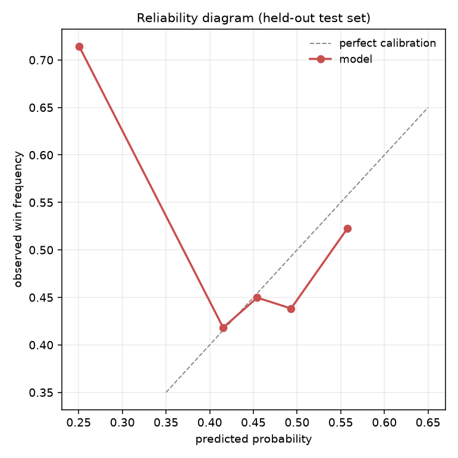

# valorant-winrate-predictor

Predicts each team's win probability the moment you load into a VALORANT match,
using only what is knowable before the first round — then explains the
prediction in plain English.

> **Status: Phases 0–5 complete.** The results below are measured on a held-out
> test set, not estimated. The live dashboard and coaching layer (Phases 6–8)
> are not built yet.

---

## The problem

When ten players load into a match, the outcome is not a coin flip — but it is
close to one. Rank-based matchmaking exists specifically to make it close. The
question is whether the residual signal, after matchmaking has done its job, is
large enough to measure.

A naive approach compares average K/D. That fails, because K/D is mostly a
function of rank, and matchmaking already equalised rank. The signal has to come
from what matchmaking *does not* account for:

- A player who is significantly better on this specific map
- A player on an agent they perform well or badly on
- The **interaction** — someone mediocre on Ascent generally, but strong on
  Ascent specifically as Jett
- Team composition: role balance, missing controller, duelist stacks
- Party structure — a five-stack coordinates in ways five solo queuers do not
- Skill *variance* within a team, which the average hides entirely
- Recent form, and how long the current session has been running

## Approach

```
  HenrikDev API              Riot local client API
  (bulk match history)       (live: the 10 PUUIDs, agents, teams)
         |                              |
         v                              v
  +----------------+            +----------------+
  | rate-limited   |            | lockfile auth  |
  | snowball crawl |            | ws match watch |
  +----------------+            +----------------+
         |                              |
         v                              |
  +---------------------------+         |
  | temporal store            |         |
  | "what did we know about   |<--------+
  |  player X as of time T"   |
  +---------------------------+
         |
         v
  +----------------+     +------------------+     +-------------------+
  | player rating  |---->| time-gated       |---->| calibrated model  |
  | opponent-adj.  |     | feature builder  |     | + SHAP            |
  +----------------+     +------------------+     +-------------------+
                                                          |
                                            +-------------+-------------+
                                            v                           v
                                   +----------------+          +----------------+
                                   | live dashboard |          | Claude coach   |
                                   | localhost      |          | grounded in    |
                                   |                |          | attributions   |
                                   +----------------+          +----------------+
```

### Player rating

tracker.gg's developer program does not cover VALORANT, so Tracker Score is not
available to third-party developers. Rather than work around that, this project
builds its own rating: a composite of ACS, ADR, first-blood and first-death
rate, clutch rate, trade participation, and multi-kill rate — normalised
*within rank band and map*, then adjusted for the average rank of the opposing
team. Validated by split-half reliability across each player's history, and by
whether it out-predicts raw ACS on a player's next match.

### Avoiding the obvious trap

Match data is a time series, and the failure mode for this kind of project is
leakage — computing a feature from information that did not exist when the match
started. It inflates results, which is exactly why it goes uncaught.

Countermeasures, enforced in tests rather than by discipline:

- Every feature is derived only from rows with a strictly earlier timestamp,
  through a single temporal query layer
- Time-ordered train/validation/test splits; no random k-fold
- Empirical-Bayes shrinkage on every rate feature, so a 3-game sample at 100%
  does not read as a 100% player
- A shuffled-target check: retrain on shuffled labels and assert AUC collapses
  to 0.5

## Results

Measured on a held-out, time-ordered test set of **2,288 matches** never touched
during training or tuning. 11,062 matches with at least 5 of 10 players having
prior history; 52 features.

| Model | Log loss | Brier | AUC | Accuracy |
|---|---|---|---|---|
| **Avg rating (1 feature)** | **0.6908** | 0.2488 | 0.539 | **53.1%** |
| Logistic regression (52 feat.) | 0.6913 | 0.2490 | **0.549** | 53.0% |
| Best-player rank (1 feature) | 0.6913 | 0.2491 | 0.535 | 52.9% |
| Gradient boosting (52 feat.) | 0.6923 | 0.2495 | 0.540 | 52.5% |
| Avg rank — *the baseline to beat* | 0.6924 | 0.2496 | 0.519 | 51.5% |
| Coin flip | 0.6931 | 0.2500 | 0.500 | 48.6% |

**Accuracy 53.1% ± 2.0%** (95% CI). Shuffled-target check: **AUC 0.499** — clean,
so this is not leakage.

### Reading this honestly

**The signal is real but very weak, and smaller than expected.** I predicted AUC
0.60–0.68 before building. The measured ceiling is **0.549**. That prediction was
too optimistic and the data says so.

**A single feature beats the full pipeline.** `avg rating` — the Phase 3 metric
alone — edges out both the 52-feature logistic regression and the gradient
booster on log loss. All the composition, party-structure and map×agent work
adds essentially nothing on top of it. Gradient boosting scoring *below* the
linear model is the classic signature of a booster overfitting weak signal.

**On equal-rank matches, nothing beats a coin flip.** This is the result that
matters most. Restricted to the 842 test matches where team average ranks are
within half a tier — where matchmaking did its job and any remaining signal is
the genuine residual — the best model scores **51.7% ± 3.4%**. That interval
contains 50%. So the honest conclusion is that most of what the model finds is
**rank in disguise**, and the features add little beyond it at this sample size.

### Why that is still worth reporting

Matchmaking is designed to make matches even. It is very good at it. A project
that reports 90% accuracy on pre-match VALORANT prediction has undetected
leakage, not a breakthrough — which is why the shuffled-target check, the
truncation audit and the equal-rank subset are all in the repo and all run.

What would move these numbers: more data (a ±1.5% interval needs ~28,000 usable
matches against the current 11,000), and in-round state, which is a different
and much larger problem.



Calibration is decent where the data is dense — the 1,226-match bin predicts
0.558 against an observed 0.523, and expected calibration error is 0.011–0.024
across models. Isotonic calibration made log loss *worse* on this signal
(0.6976 vs 0.6922) by overfitting the validation slice, so the pipeline now
picks between isotonic and Platt on held-out data rather than by preference.

## Setup

Requires a [HenrikDev API key](https://api.henrikdev.xyz/dashboard/) (generated
via their Discord) and, for the coaching layer, an Anthropic API key.

```bash
git clone https://github.com/<user>/valorant-winrate-predictor
cd valorant-winrate-predictor
python -m venv .venv && source .venv/Scripts/activate
pip install -r requirements.txt
cp .env.example .env      # fill in HENRIK_API_KEY
python -m valwr.check     # smoke test
```

## Scope and limitations

- **NA / PC / competitive queue only.** Regional metas differ enough that a
  model trained on one does not transfer cleanly.
- **Pre-match data only.** No in-round or economy state; this predicts at the
  loading screen, not during play.
- **The live component only works on the machine running the game**, since it
  reads the local client API.
- **Player data is not redistributed.** The collected database stays local and
  is not committed.

## Ethics and Terms of Service

The local client integration is strictly read-only — it reads match state and
never writes, never automates agent selection, and never touches process memory.
See [docs/ETHICS-AND-TOS.md](docs/ETHICS-AND-TOS.md).

Not affiliated with or endorsed by Riot Games.

## Licence

MIT
