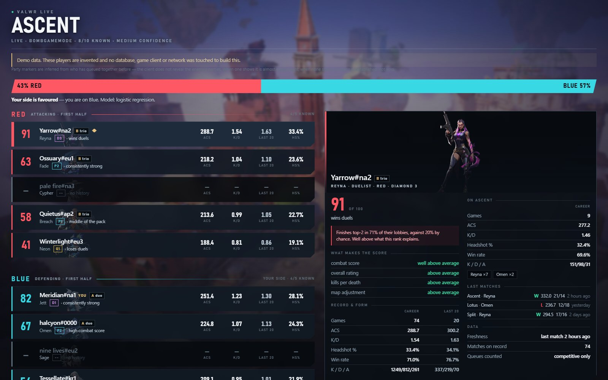
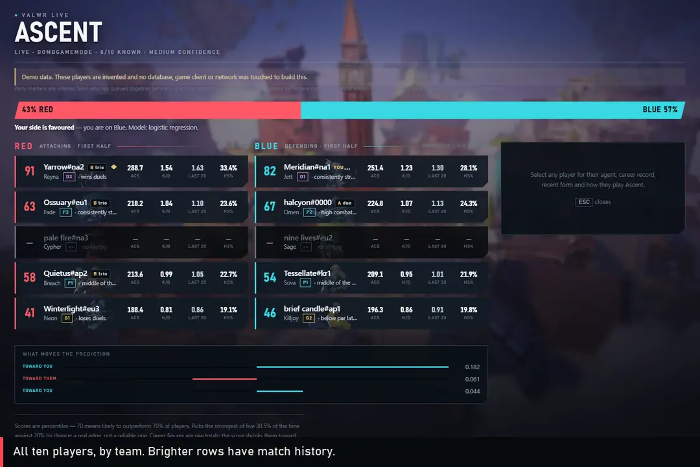
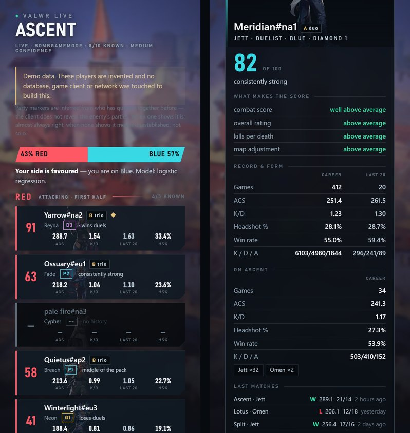

# The live dashboard

A page on your own PC that shows the match you have just loaded into: both
teams' odds, all ten players, and what is known about each of them. It updates
by itself every five seconds, from agent select through the match.

**[Try the interactive demo](https://fahranalam04-cmd.github.io/valorant-winrate-predictor/)**
— the real page, running in your browser with invented players. Change the
map, your side, the phase and how much of the lobby is known; click any player.

Every image here and the demo use the invented lobby from `valwr/dash/demo.py`.
No real player appears in them.

---

## Running it

| Command | What it does |
|---|---|
| `dashboard.bat` | The live view, on this PC only. Needs VALORANT running here. |
| `phone.bat` | The same, readable from a phone on your wifi. Prints the address to open. |
| `live.bat` | The same information in the terminal instead of a browser. |
| `python -m valwr.dash --demo` | The invented match, to see the page without playing. |
| `python -m valwr.dash --match <id>` | A finished match, rebuilt from only what was knowable at its loading screen. |

`dashboard.bat` runs a preflight check first and says in plain language if
anything is missing: the model, the database, the artwork, or the game. Agent
and map art is downloaded once with `python tools/fetch_agent_art.py`; without
it, players show a lettered tile and the background is plain.

---

## Reading the page, top to bottom

### Header

- **The map**, in large type, with its key art as the page background.
- **Phase** — *Agent select*, *Live*, or *Custom* for a custom game — then the
  game mode, **how many of the ten players have match history**, and the
  **confidence** that follows from it.
- The small square by the name is the connection: lit while the page is
  receiving updates. If the server stops, the page says so after two failed
  reconnects rather than showing a stale match.

### Warnings

Shown only when they apply:

- the mode is not standard bomb defusal, so the model's odds do not apply
- the teams are uneven (in a custom game)
- you are spectating or coaching, so odds are given from Blue's side
- agent select hides the enemy team until the match starts

When any party marker was **inferred** rather than known, a line says so — see
*Parties* below.

### The odds

The bar splits 100% between **Red** and **Blue**, and the verdict under it reads
from your side:

| Your side's chance | Verdict |
|---|---|
| within 1.5 points of 50% | Too close to call |
| within 5 points | marginally ahead / behind |
| within 12 points | favoured |
| within 25 points | clearly favoured |
| beyond that | heavily favoured |

Expect most matches in the first three rows. Nine predictions in ten fall
between 40% and 60%, and that is the model being honest about a matchmaker
that works: when it says 60%, that side wins about 60% of the time.

### What moves the prediction

The few features pushing the odds hardest, with a bar for how hard and a label
for which way — **toward you** or **toward them**. For the linear model this is
exact: each bar is that feature's weight times how far apart the teams are on
it, and together they make up the prediction.

### The two teams

Side by side on a wide screen, one above the other on a narrow one. In bomb
defusal each column is labelled with the side it **starts** on — Red attacks
first, Blue defends — because the client does not report the halftime swap.

Every player is a row. **Bright rows have match history; dim rows do not**, and
show dashes rather than guesses.

| On the row | Meaning |
|---|---|
| **Score, 0–100** | A percentile against the training population: 70 means likely to outperform 70% of players. Built from combat score, the player rating, K/D and a small map term. |
| Name, **YOU** | Your own row is marked. |
| **A duo / B trio** | A party, lettered so teammates in the same group match. |
| ◆ | Playing far above their rank — see *The flag* below. |
| Agent, **rank** | The rank badge is the short form (D3 = Diamond 3); hover for the full name. |
| Reason | The largest thing lifting or lowering the score, in words: *wins duels*, *consistently strong*, *below par lately, but only 4 games*. |
| **ACS** | Average combat score, career. |
| **K/D** | Career kills over career deaths — pooled, the way trackers compute it. |
| **Last 20** | K/D over their twenty most recent games: current form. |
| **HS%** | Headshots as a share of all hits. |

**Every statistic counts competitive games only.** Swiftplay, customs and the
rotating modes are excluded inside the database query, not afterwards.

### A player's card

Click a row (or tab to it and press Enter); **Esc** closes it. On a wide screen
the card fills two columns so nothing needs scrolling.

- **Portrait, name, party, agent, role, team and full rank.**
- **The score** with its reason, and the flag's explanation when it fires.
- **What makes the score** — each component marked above or below average.
  The map adjustment reads *not counted* until the player has six games on this
  map: below that, map history is noise, and it contributes exactly zero.
- **Record & form** — career beside the last 20: games, ACS, K/D, headshot %,
  win rate and kills/deaths/assists. When all of a player's stored games fall
  inside the last 20, the card says the two columns are the same games.
- **On this map** — the same record for this map only, and the agents they
  have played here.
- **Last matches** — map, agent, win or loss, ACS, kills and deaths, and how
  long ago.
- **Data** — how fresh their history is, how many matches are on record, and a
  reminder that only competitive games count.

---

## Where the numbers come from

**The lobby** is read from the VALORANT client on your PC — the ten players,
agents and teams — and nothing is ever sent back to it. See
[ETHICS-AND-TOS.md](ETHICS-AND-TOS.md).

**Each player's history** comes from the local database the crawler builds. When
a match loads, players are refreshed from the HenrikDev API if their newest
stored game is more than **two hours** old or they have fewer than five on
record — your own account always, then your team, then the enemy — within a
25-second budget. Two pages of match history are fetched, so the last 20 really
is twenty games. Anyone not refreshed in time is shown with what is known, and
the confidence drops.

**Parties.** In a replay they are exact: finished matches record who queued
together. In a live lobby the client does not reveal the enemy's party, so it is
**inferred** from whether two players have queued together before. Measured,
that inference is right 99.8% of the time when it shows a group, and finds
about half of the real groups — so **no marker means "not established", not
"solo"**.

**The prediction** is the shipped logistic regression over 52 differences
between the teams. How it was chosen, and every other model tried, is in
[MODEL-CHOICE.md](MODEL-CHOICE.md).

---

## What the numbers can and cannot tell you

- **The odds are modest because the games are close.** 54.3% accuracy on
  10,304 held-out matches is a real edge over rank, which scores 50.2%, and it
  holds on matches where both teams' ranks are equal. It is not a forecast to
  bet on.
- **The score picks the best player on a team 30.5% of the time**, against 20%
  by chance. A real edge, not a reliable one — the page footer says the same.
- **The score favours duelists.** It leans on combat score, which duelists earn
  more of: at identical skill, a duelist main scores well above an initiator
  main. Read it as "likely to put up numbers", not "better at the game".
- **The flag is not a smurf detector.** It fires on about one player in twenty:
  those rated well above their own rank *and* topping their lobbies far more
  often than the 20% chance rate. Flagged players finish in the top third of a
  lobby 44% of the time against 29% for everyone else. It cannot tell a smurf
  from a returning player or someone mid-climb.
- **The map barely moves anything**, on purpose. Map-specific history showed no
  measurable predictive power, so the page never gives it as a reason.

---

## Security

The server listens on `127.0.0.1` unless you run `phone.bat`, serves only the
match you are in, and has no route that takes a player. It refuses requests
addressed to a domain name and websocket connections from any other site, and
the page escapes everything it prints. [SECURITY.md](../SECURITY.md) has the
detail.

