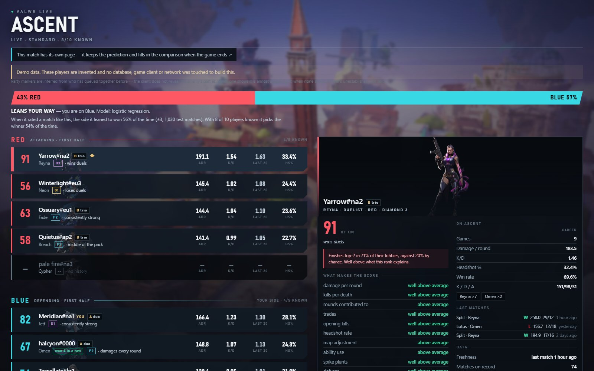
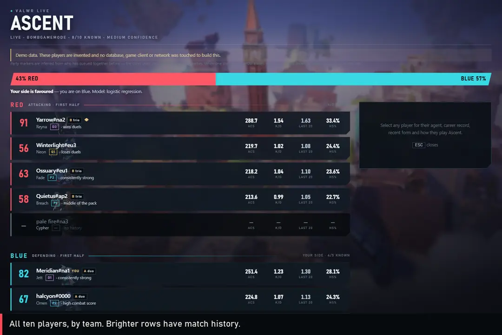
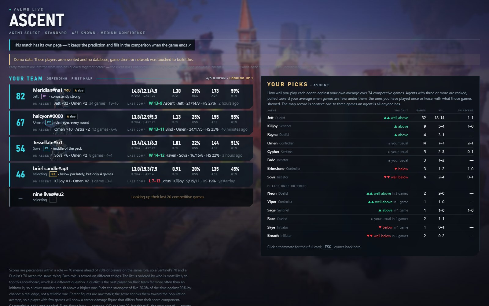
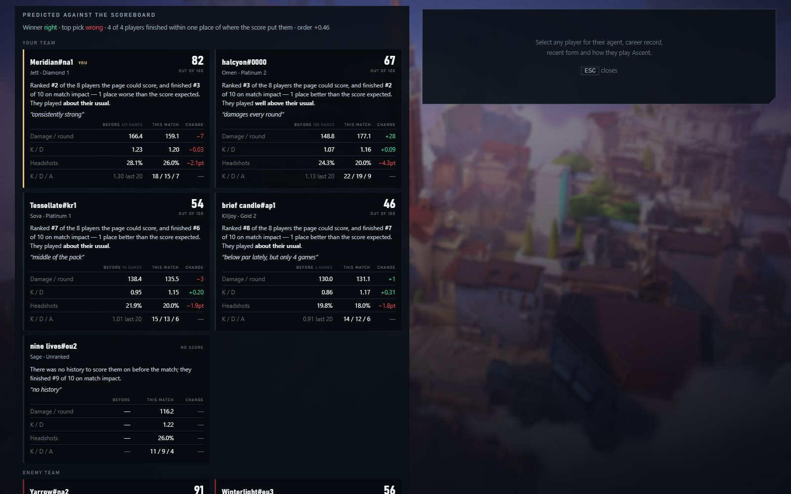
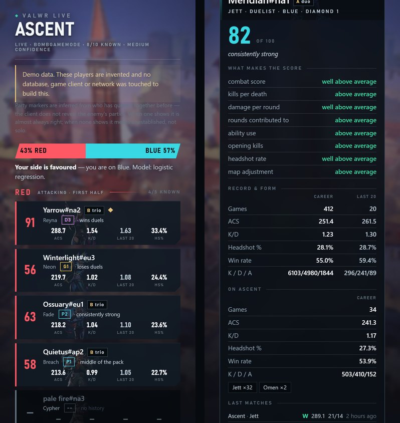

# The live dashboard

A page on your own PC that shows the match you have just loaded into: both
teams' odds, all ten players, and what is known about each of them. It updates
by itself, from agent select through the match: every three seconds, and at
once when the game announces agent select, a lock-in or the match starting.



**[Try the interactive demo](https://fahranalam04-cmd.github.io/valorant-winrate-predictor/)**
— the real page, running in your browser with invented players. Change the
map, your side, the phase and how much of the lobby is known; click any player.

Every image here and the demo use the invented lobby from `valwr/dash/demo.py`.
No real player appears in them.

---

## Running it

| Command | What it does |
|---|---|
| `dashboard.bat` | The live view, on this PC only. Needs VALORANT running here. |
| `phone.bat` | The same, readable from a phone on your wifi. Prints the address to open. |
| `live.bat` | The same information in the terminal instead of a browser. |
| `python -m valwr.dash --demo` | The invented match, to see the page without playing. |
| `python -m valwr.dash --demo pregame` | The same, in agent select: your team as cards, one player still being looked up. |
| `python -m valwr.dash --match <id>` | A finished match, rebuilt from only what was knowable at its loading screen. |

`dashboard.bat` runs a preflight check first and says in plain language if
anything is missing: the model, the database, the artwork, or the game.

**Running it twice is fine.** A second `dashboard.bat` finds the first one, opens that page and exits, rather than failing to claim the port. If something unrelated holds port 8787, it moves to the next free one and says so.

**It comes back to the same port.** Every match has a page of its own, and each
of those is an address with a port in it. The port last used is remembered
beside the database, so the next run lands there and yesterday's tabs still
load. A tab that is already open reconnects by itself within a few seconds of
the dashboard restarting.

**If a tab says "this site can't be reached"**, nothing is listening on that
port — the dashboard is not running, or it was pushed onto a different port by
something else holding the old one. Start `dashboard.bat` and keep its window
open; the tab works again on reload. The dashboard prints which port it took
and says when an earlier run's tabs will not load.

**Leave it running.** It follows you from match to match on its own, and
recovers by itself when the game client's session ages out (about an hour) or
when VALORANT restarts and its local port changes -- both of which used to
leave the page stuck on an error until the window was restarted. The page says
what it is doing while the first match resolves, which can take a few seconds
for a lobby of players it has never seen. Agent
and map art is downloaded once with `python tools/fetch_agent_art.py`; without
it, players show a lettered tile and the background is plain.

---

## Reading the page, top to bottom



### Header

- **The map**, in large type, with its key art as the page background.
- **Phase** — *Agent select*, *Live*, or *Custom* for a custom game — then the
  game mode and **how many of the ten players have match history**. It used to
  add "high confidence" from that count, which read as how sure the prediction
  was; it measured only how much was known, so it says the count and stops.
- The small square by the name is the connection: lit while the page is
  receiving updates. If the server stops, the page says so after two failed
  reconnects rather than showing a stale match.

### Warnings

Shown only when they apply:

- the mode is not standard bomb defusal, so the model's odds do not apply
- the teams are uneven (in a custom game)
- you are spectating or coaching, so odds are given from Blue's side
- agent select hides the enemy team until the match starts

When any party marker was **inferred** rather than known, a line says so — see
*Parties* below.

### The odds

The bar splits 100% between **Red** and **Blue**, and the verdict under it reads
from your side, as a lean:

| Your side's chance | Verdict |
|---|---|
| within 2 points of 50% | Coin flip |
| within 5 points | Slight lean your way / their way |
| beyond that | Leans your way / their way |

Nothing says "favoured". The model is calibrated but modest: across its
10,304 test matches the lowest tenth of its calls averaged 40% for Blue and the
highest tenth 60%, they meant what they said -- when it rated a side at 60%,
that side won 61% -- and it picked the winner 54% of the time. So under the verdict is what a number like this has
meant:

- **What the same call meant in testing** -- how often the side it leaned to
  won, among the test matches it rated like this one, with the margin on that
  figure: *the side it leaned to won 56% of the time (±3, 1,030 test matches)*.
  A call stronger than almost any it made in testing says so.
- **How often it picks the winner with this many players known** -- 52% with 5
  or 6, 55% with 9 or 10. Below five known, the prediction is outside what it
  was tested on, and the line says that instead.

Both come from `reports/results.json`, and only when that file describes the
model loaded; after a retrain without one, the line is left out rather than
quoting another model's record (`valwr/model/calibration.py`).

### What moves the prediction

The few features pushing the odds hardest, with a bar for how hard and a label
for which way — **toward you** or **toward them**. For the linear model this is
exact: each bar is that feature's weight times how far apart the teams are on
it, and together they make up the prediction.

### Agent select



About a minute to lock in, and Riot has not shown you the enemy yet, so the
page gives the whole screen to your own team: one card per player, with
everything showing at once rather than behind a click.

- **The 0–100 rating**, the same score as in the match
- **Last 20** competitive games, per game: K/D/A, then K/D, headshot %,
  damage per round and win rate. The label says how many games it really
  covers when fewer than twenty are stored.
- **On this map**: the agents they have played here most, with their record
- **Last comp**: result and round score, map, agent, K/D/A, headshot %, and
  how long ago
- **A run this session** beside the name -- *lost 3 in a row*, *won 4 in a
  row* -- for three or more results the same; see below

Agent select is detected as it starts. The game announces it -- and every
hover and lock after it -- on the client's local event channel, and each
announcement brings the next poll forward, no closer than a second apart. If
that channel is unavailable, the three-second poll carries on as before.
Players already in the database appear the moment agent select is detected --
about 30 ms for a whole team, measured. Anyone who is not stored shows
*Looking up their last 20* until their lookup lands, and each card fills in
as it does; teammates are looked up before your own account. A player whose
lookup has finished with nothing to find says *No competitive history*,
which is a different thing and is never shown early.

Each card is two rows -- who they are beside their numbers, then this map
beside their last game -- so all five fit a maximised 1080p browser without
scrolling, and the numbers sit in the same columns on every card. A test lays
the page out in a real browser and fails if the fifth player ever drops below
a 1920x800 or 2560x1300 window again.

**The team's roles so far** sit in a strip above the cards, one slot per role:
who has locked an agent, who is still hovering one (a hover can change, and is
marked as one), and, for anyone undecided, the role their last twenty
competitive games point to, with its share -- a 16-of-20 main reads
differently from a 9-of-20 flex player. A role nobody covers is marked open,
and the undecided teammate's card says the same thing ("likely Sentinel
9/20"). You are left out while you are still choosing; that is the decision
this is for.

**Your picks** fill the side panel: the agents you play best, measured by
match impact against your own average rather than by win rate, which is half
your teammates' and mostly noise at these sample sizes. Agents with three or
more games are ranked, each pulled toward your average in proportion to how
few games it rests on. Under them sit the agents you have played once or
twice, with what those games showed and how many there were -- shown, not
dropped. Your record on this map is beside each as context only: one to three
games an agent per map is all anyone has. An agent whose role nobody on your
team covers yet is marked "open role".

Clicking a card opens that teammate's full breakdown in the side panel in
place of your picks, and ESC brings them back.

### The two teams

Side by side on a wide screen, one above the other on a narrow one. In bomb
defusal each column is labelled with the side it **starts** on — Red attacks
first, Blue defends — because the client does not report the halftime swap.

Every player is a row. **Bright rows have match history; dim rows do not**, and
show dashes rather than guesses.

| On the row | Meaning |
|---|---|
| **Score, 0–100** | A percentile **within the player's role**: 70 means ahead of 70% of players on that role, so a Sentinel's 70 and a Duelist's 70 are the same claim. Each role is scored on different things — see [SCORE-SPEC.md](SCORE-SPEC.md). |
| Name, **YOU** | Your own row is marked. |
| **A duo / B trio** | A party, lettered so teammates in the same group match. |
| ◆ | Playing far above their rank — see *The flag* below. |
| Agent, **rank** | The rank badge is the short form (D3 = Diamond 3); hover for the full name. |
| **lost 3 in a row** | Your team only: three or more results the same this session, after the agent -- on this row there is no room beside the longest names. See *A run this session* below. |
| Reason | The largest thing lifting or lowering the score, in words: *wins duels*, *consistently strong*, *below par lately, but only 4 games*. |
| **ADR** | Damage per round, career. It replaced combat score on this page when patch 13.06 removed ACS from the game's own scoreboard. |
| **K/D** | Career kills over career deaths — pooled, the way trackers compute it. |
| **Last 20** | K/D over their twenty most recent games: current form. |
| **HS%** | Headshots as a share of all hits. |

**Every statistic counts competitive games only.** Swiftplay, customs and the
rotating modes are excluded inside the database query, not afterwards.

### A run this session

Your teammates -- in agent select and on your side of the scoreboard -- carry
a badge when their last three or more competitive games went the same way:
*lost 3 in a row*, *won 4 in a row*. A session ends at a break of two hours
between one game finishing and the next starting, so last night's losses are
not tonight's run, and a draw ends a run too.

**It is shown as what happened, and nothing reads it.** The score and the
prediction are unchanged by it, because it was measured first and predicts
nothing about the next game (`python tools/measure_streaks.py`, 787,460
competitive games):

| Going into the game after | Games | Next game won |
|---|---|---|
| 4+ losses in a row | 986 | 48.1% ± 3.1 |
| 3 losses in a row | 2,958 | 52.2% ± 1.8 |
| 2 losses in a row | 13,181 | 50.0% ± 0.9 |
| the first game of a sitting | 601,281 | 49.9% ± 0.1 |
| 2 wins in a row | 15,778 | 50.7% ± 0.8 |
| 3 wins in a row | 4,005 | 50.9% ± 1.5 |
| 4+ wins in a row | 1,568 | 49.7% ± 2.5 |

Every row is 50% within its margin. Damage per round moves a little, the
other way from tilt -- about +2 after losses and -2 to -5 after wins against
the player's own average -- which is what matchmaking answering a run with an
easier or harder lobby would look like.

**A badge is only shown when it is current.** Stored history can be a game
behind: a teammate whose newest stored game began under 55 minutes ago cannot
have finished another since, but anyone else might have. Their latest page of
games is fetched again, as the last thing the lookup does -- after every
rating and your own account -- and until it answers, the card shows no badge
rather than one that may be out of date. In a busy agent select it can arrive
during the loading screen.

### A player's card

Click a row (or tab to it and press Enter); **Esc** closes it. On a wide screen
the card fills two columns so nothing needs scrolling.

- **Portrait, name, party, agent, role, team and full rank.**
- **The score** with its reason, and the flag's explanation when it fires.
- **What makes the score** — each component marked above or below average.
  The map adjustment reads *not counted* until the player has six games on this
  map: below that, map history is noise, and it contributes exactly zero.
- **Record & form** — career beside the last 20: games, damage per round, K/D, headshot %,
  win rate and kills/deaths/assists. When all of a player's stored games fall
  inside the last 20, the card says the two columns are the same games.
- **On this map** — the same record for this map only, and the agents they
  have played here.
- **Last matches** — map, agent, win or loss, damage per round, kills and deaths, and how
  long ago.
- **Data** — how fresh their history is, how many matches are on record, and a
  reminder that only competitive games count.

---

## A page per match, and the scorecard

**One tab, from agent select into the game.** The tab at `/` follows you:
your team as cards in agent select, and the same tab becomes the scoreboard
and the odds when the match loads. Between the two, Riot briefly answers
neither "agent select" nor "in a match" -- measured at over a second, and the
game announces the match before it can be read -- so for up to 20 seconds the
cards stay up and the line under the map says the match is loading. If
nothing loads, someone dodged, and the page goes back to waiting.

**Each match also has a page of its own** at `/m/<match id>`, which keeps
that match exactly as it was predicted; nothing is overwritten by the next
game. It is linked from the live view once the match has loaded, and from the
list of recent matches between games. Nothing pops up. `--tabs` opens each
match's page in a new tab as it loads, as earlier versions did by default --
never during agent select, when there is nothing on it yet.

**A pinned tab fills in the result.** A few minutes after the match ends, the
dashboard spends one API call on it and the tab shows:

- won or lost, the final score, and whether the prediction was right
- **a block per player, not a summary row**: every player who played gets
  their 0-100 score, the reason the score gave, and where it ranked them,
  against where they actually finished -- ranked by the game's own
  Performance Score, read from your client after the match while the game is
  open, or by match impact where it has not been, never a mix; the page says
  which, and the scorecard counts the same measure -- then their own career
  damage per round,
  K/D and headshot rate from before the match set against what they did in
  it, with the change signed in each row.

  The per-player comparison is deliberately against the player rather than
  against the lobby. The 0-100 already ranks players against each other; what
  the finished scoreboard can add is whether someone played like themselves,
  which is why each block leads with "about their usual", "above their usual"
  and so on. "Before" never includes the match itself -- it is the same
  point-in-time career line the page showed while the game was loading.
- **a line saying how much it got right**: winner right or wrong, top pick
  right or wrong, how many players finished within one place of where the score
  put them, and the rank correlation across the lobby



The demo has this state too, without playing: pick **After the game** from its
Status control, or open
[the demo with the result showing](https://fahranalam04-cmd.github.io/valorant-winrate-predictor/?status=finished).

**The scorecard** at `/results` is every match the dashboard has recorded:
how often it called them right, how its predicted percentages compare with how
often you actually won, and the same broken down by how much of the lobby was
known and by its stated confidence. It reports the interval around every figure
and says plainly when there are too few matches to conclude anything -- around
30 is where it starts to mean something.

Two rules keep it honest. **Only standard bomb defusal counts** toward the
figures, because that is all the model was trained on; other modes are recorded
and listed but excluded.

And the record of *what was predicted* is never a feature or a label. The
finished matches themselves are stored like any other match and reach training
the ordinary way, through the time-ordered split -- being your newest matches,
they land in validation or test rather than training. That distinction is the
whole point: a match used to train the model can no longer measure it, so
`tools/improve.py` checks where each recorded match sits and says so instead of
quietly counting it.

## Improving the model from the record

```bash
python tools/improve.py             # where it is wrong, and what that suggests
python tools/improve.py --retrain   # measure, retrain, measure again
```

The report splits your matches by map, by how much of the lobby was known, by
stated confidence and by what it predicted, with the interval on every figure,
then re-scores every recorded match with the model *as it stands now* -- rebuilt
at each match's own start time through the replay path, so a match still cannot
inform its own prediction. That gives a straight comparison between the model
that was live at the time and the one you have now, on identical matches.

`--retrain` measures, retrains on the grown data, refits the player-score index
and measures again, then names how many of your matches have moved inside the
training window and therefore no longer count as a fair test.

The prediction stored is the **first** one for the match -- what the page said
at the loading screen. A later poll knows more, so letting it overwrite would
score a prediction nobody saw. Agent select is the exception: it only sees your
own team, so it is replaced once the match proper starts.

---

## Where the numbers come from

**The map name** is translated. The client reports an internal codename -- Summit is "Plummet", Lotus is "Jam" -- so the live view resolves it through the reference table before naming the map or loading its art. Run `python -m valwr.check` after a patch to pick up a new map.

**The lobby** is read from the VALORANT client on your PC — the ten players,
agents and teams — and nothing is ever sent back to it. See
[ETHICS-AND-TOS.md](ETHICS-AND-TOS.md).

**Each player's history** comes from the local database the crawler builds. When
a match loads, players are refreshed from the HenrikDev API if their newest
stored game is more than **two hours** old or they have fewer than five on
record — your own account always, then your team, then the enemy — within a
25-second budget. Two pages of match history are fetched, so the last 20 really
is twenty games. Anyone not refreshed in time is shown with what is known, and
the confidence drops.

**Parties.** In a replay they are exact: finished matches record who queued
together. In a live lobby the client does not reveal the enemy's party, so it is
**inferred** from whether two players have queued together before. Measured,
that inference is right 99.8% of the time when it shows a group, and finds
about half of the real groups — so **no marker means "not established", not
"solo"**.

**The prediction** is the shipped logistic regression over 52 differences
between the teams. How it was chosen, and every other model tried, is in
[MODEL-CHOICE.md](MODEL-CHOICE.md).

---

## What the numbers can and cannot tell you

- **The odds are modest because the games are close.** 54.3% accuracy on
  10,304 held-out matches is a real edge over rank, which scores 50.2%, and it
  holds on matches where both teams' ranks are equal. It is not a forecast to
  bet on.
- **The score picks the best player on a team 29.6% of the time**, against 20%
  by chance. A real edge, not a reliable one — the page footer says the same.
- **The list order and the number are answering different questions.** The
  0–100 is a percentile *within a role*. The order is across the lobby, by the
  underlying cross-role figure, because a duelist is the best player on their
  team in 43.5% of matches and an initiator in 14.6% — and scoring everyone
  against their own role erases exactly that. So **a lower number can sit above
  a higher one**, and the page says so. Ordering by the displayed number
  instead costs 1.3 points of accuracy (29.6% → 28.3%).
- **It is still behind the single formula it replaced**, which scores 30.9% on
  the same teams. That was a deliberate trade: the number describes what each
  role is trying to do. docs/SCORE-SPEC.md carries the measurement, including
  the criteria it failed.
- **Almost nothing can do better.** Only 16% of the variation in one match's
  performance is the player; the rest is the night they had. A score that knew
  every player's true long-run level exactly would reach about 38%.
- **Roles are no longer scored on the same things.** A Duelist is damage-led
  and is the only role scored on opening kills; Controllers lean on KAST,
  assists and ability use; Sentinels are the only role penalised for dying
  first. Chamber is scored on a Duelist/Sentinel blend, because his kit is a
  rifle rather than utility.
- **Ability use is the weakest input in the score.** It is 11–20% of the weight
  depending on role, and it is a count of button presses: a drone that spots
  three players and a drone thrown at a wall are identical in this data. It
  correlates with actual performance at roughly zero, while being one of the
  most *stable* things about a player — so it reliably separates players by
  playstyle rather than by quality. It is in the score because the score is
  meant to describe the role, not because it predicts.
- **The flag is not a smurf detector.** It fires on about one player in twenty:
  those rated well above their own rank *and* topping their lobbies far more
  often than the 20% chance rate. Flagged players finish in the top third of a
  lobby 44% of the time against 29% for everyone else. It cannot tell a smurf
  from a returning player or someone mid-climb.
- **The map barely moves anything**, on purpose. Map-specific history showed no
  measurable predictive power, so the page never gives it as a reason.

---

## Security

The server listens on `127.0.0.1` unless you run `phone.bat`, serves only the
match you are in, and has no route that takes a player. It refuses requests
addressed to a domain name and websocket connections from any other site, and
the page escapes everything it prints. [SECURITY.md](../SECURITY.md) has the
detail.


